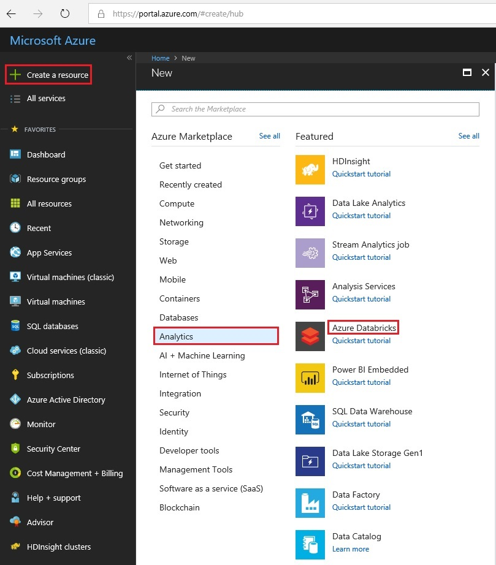
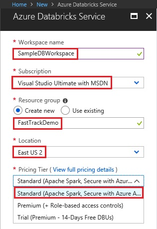

# Fast Track for Azure - Databricks

This folder is work in progress, please stay tuned! 

# Abstract

During this module you will learn how to create Azure Databricks workspace

# Learning Objectives

By the end of this module you will be able to:

* Use the Azure Portal to create Azure Databricks workspace

## Pre-Requisites

* Azure subscription
If you don't have an Azure subscription, create a [free account](https://azure.microsoft.com/free/?ref=microsoft.com&utm_source=microsoft.com&utm_medium=docs&utm_campaign=visualstudio) before you begin.

* Azure roles
To create Azure Databricks Workspace, the user account that you use to sign in to Azure must be a member of the contributor or owner role, or an administrator of the Azure subscription. In the Azure portal, select your username in the upper-right corner, and select Permissions to view the permis-sions that you have in the subscription. If you have access to multiple subscriptions, select the appropriate subscription. For sample instructions on adding a user to a role, see the [Add roles](https://docs.microsoft.com/en-us/azure/billing/billing-add-change-azure-subscription-administrator) article.

# Estimated time to complete this module:
Self-guided (10 minutes approx)

# Creating a New Azure Databricks Workspace

To create a create an Azure Databricks workspace:

* Navigate to the portal at [https://portal.azure.com](https://portal.azure.com)
* From the left hand menu select **Create a resource**
* Select **Analytics** 
* Select **Azure Databricks.**

From the New Database Blade:

* Enter a name for your workspace *SampleDBWorkspace*
* Select your subscription
* Create a new Resource Group called *FastTrackDemo*
* Select a Location for the server *EastUS2 in this Example*
* Select a pricing tier from the drop dwon "Standard (Apache Spark, Secure with Azure A...")

The workspace creation takes a few minutes. There will be a progress bar displayed near the right top of the screen.