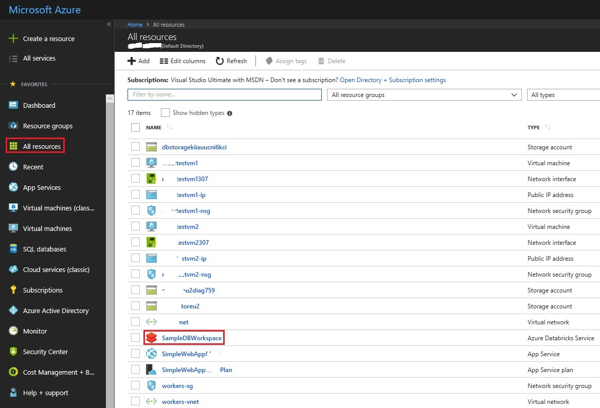
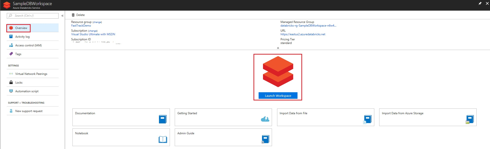
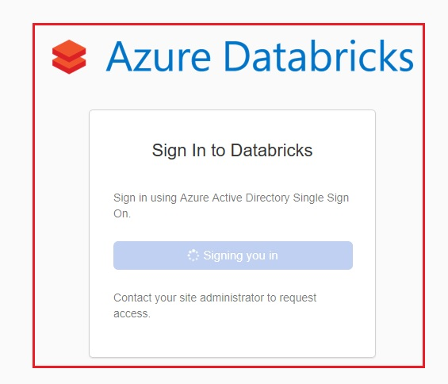
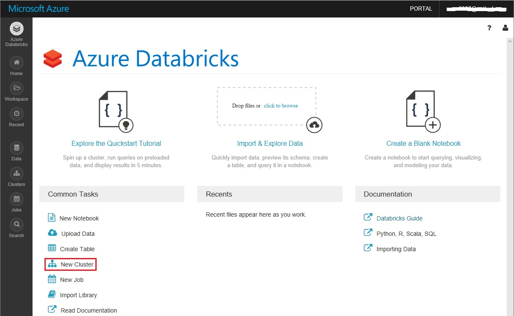

# Fast Track for Azure - Databricks

This folder is work in progress, please stay tuned! 

# Abstract

During this module you will learn how to create Spark cluster your Azure Databricks workspace

# Learning Objectives

By the end of this module you will be able to:

* Use the Azure Portal to navigate to your Azure Databricks workspace and create a Spark Cluster in the workspace.

## Pre-Requisites

* Azure Databricks Workspace is already created on your subscription.

# Estimated time to complete this module:
Self-guided (10 minutes approx)

# Creating a New Spark Cluster in Azure Databricks Workspace

To create a create a Spark cluster in your Azure Databricks workspace:

* Navigate to the portal at [https://portal.azure.com](https://portal.azure.com)
* From within the portal, locate the Azure Databricks workspace you created, naviate to the workspace

* From within your Databricks workspace blade, under Overview section, click on "Launch Workspace"  

* You are redirected to the Azure Databricks login page, as shown below:

* After Azure Databricks AAD authentication succeeds, you are redirected to the Azure Databricks portal. From the portal, click **New Cluster**

From the New Cluster Page, provide the values to create a cluster. For this cluster creation, accept all other default values other than the following:

* Enter a name for the cluster.

* Make sure you select the Terminate after xxx minutes of inactivity checkbox. Provide a duration (in minutes) to terminate the cluster, if the cluster is not being used.

* Select Create cluster. Once the cluster is running, you can attach notebooks to the cluster and run Spark jobs.

The Spark Cluster creation takes a few minutes.